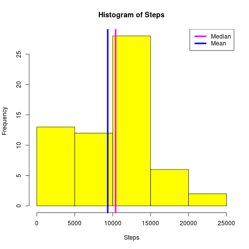
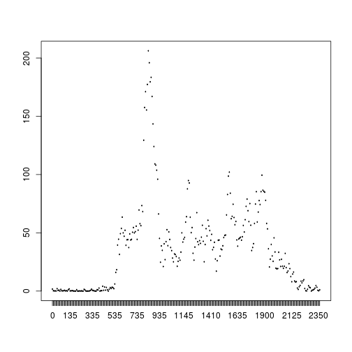
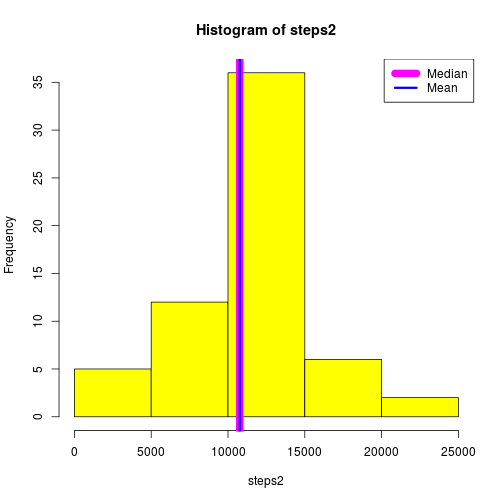
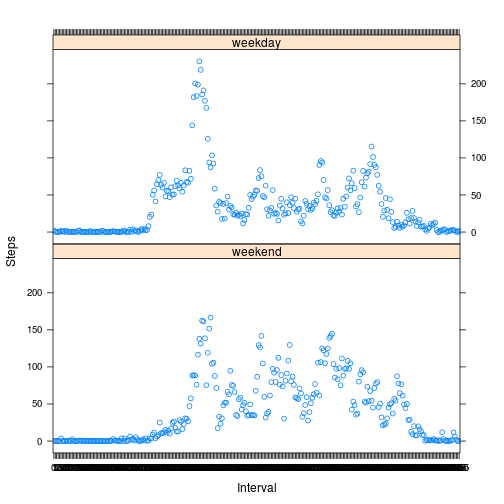

## Loading and preprocessing the data

```r
####################################################################################################
## Unzip (extract) files
unzip('./activity.zip',list=TRUE)
```

          Name Length                Date
1 activity.csv 350829 2014-02-11 10:08:00

```r
unzip('./activity.zip',list=FALSE)
####################################################################################################

####################################################################################################
## Read activity.csv.
####################################################################################################
activity_df <- read.csv('./activity.csv')
activity_df$Interval <- as.factor(activity_df$interval)
activity_df$date <- as.Date(activity_df$date)
```


## What is mean total number of steps taken per day?
1. For this part of the assignment, you can ignore the missing values in the dataset.
1. CALCULATE the total NUMBER of STEPS taken per day
1. If you do not understand the difference between a histogram and a barplot, research the difference between them. Make a histogram of the total number of steps taken each day
1. Calculate and REPORT the mean and median of the total number of steps taken per day


```r
## Calculate the number of steps taken per day
daily_steps <- aggregate(list(Steps=activity_df$steps)
                        ,by=list(Date=activity_df$date)
                        ,FUN='sum',na.rm=TRUE)

## Calculate the mean and median number of steps taken per day
mean_steps <- mean(daily_steps$Steps,na.rm=TRUE)
median_steps <- median(daily_steps$Steps,na.rm=TRUE)

## Make histogram of total number of steps taken per day.
with(daily_steps
    ,hist(Steps
         ,col="yellow"
         )
    )
abline(v = median_steps, col = "magenta", lwd = 4)
abline(v = mean_steps, col = "blue", lwd = 4)

## Add legend
legend("topright",lty,lwd=4
      ,legend=c("Median","Mean")
      ,col=c("magenta","blue")
      )
```

 

- The mean total number of steps taken per day is: 9354.2295082
- The median total number of steps taken per day is: 10395


## What is the average daily activity pattern?
1. Make a time series plot (i.e. type = "l") of the 5-minute interval (x-axis) and the average number of steps taken, averaged across all days (y-axis)
1. Which 5-minute interval, on average across all the days in the dataset, contains the maximum number of steps?

```r
## Calculate the average number of steps taken for each 5-minute interval
intvl_steps <- aggregate(list(Steps=activity_df$steps)
                        ,by=list(Interval=activity_df$Interval)
                        ,FUN='mean',na.rm=TRUE)

## Make a time series plot
with(intvl_steps
    ,plot(Interval,Steps,type="l")
    )
```

 

```r
## Find maximum average number of steps per interval.  I.e.: top record in ordered list
top_intvl_steps <- head(intvl_steps[order(intvl_steps$Steps,decreasing=TRUE),],1)
top_intvl <- top_intvl_steps[1,1]
top_steps <- top_intvl_steps[1,2]
```

- The interval with the maximum average number of steps is: 835 with 206.1698 steps taken


## Imputing missing values
1. NOTE that there are a number of days/intervals where there are missing values (coded as NA). The presence of missing days may introduce bias into some calculations or summaries of the data.
1. Calculate and report the total number of missing values in the dataset (i.e. the total number of rows with NAs)
1. Devise a strategy for filling in all of the missing values in the dataset. The strategy does not need to be sophisticated. For example, you could use the mean/median for that day, or the mean for that 5-minute interval, etc.
1. Create a new dataset that is equal to the original dataset but with the missing data filled in.
1. Make a histogram of the total number of steps taken each day and Calculate and report the mean and median total number of steps taken per day. Do these values differ from the estimates from the first part of the assignment? What is the impact of imputing missing data on the estimates of the total daily number of steps?


```r
## Find number of records with missing # of steps
missing <- sum(is.na(activity_df$steps))
```

- The total number of rows with NAs is: 2304


```r
activity1 <- merge(activity_df,intvl_steps,by = "Interval",all=FALSE)

## Create "steps2" containing interval average ("Steps") if "steps" is missing, "steps" otherwise.
activity1$steps2 <- ifelse(is.na(activity1$steps),activity1$Steps,activity1$steps)

## Aggregate new dataframe and calculate mean and median
daily_steps2 <- aggregate(list(steps2=activity1$steps2)
                         ,by=list(Date=activity1$date)
                         ,FUN='sum',na.rm=TRUE)

mean_steps2 <- mean(daily_steps2$steps2)
median_steps2 <- median(daily_steps2$steps2)

## Make histogram of total number of steps taken per day.
with(daily_steps2
    ,hist(steps2
         ,col="yellow"
         )
    )
abline(v = median_steps2, col = "magenta", lwd = 10)
abline(v = mean_steps2, col = "blue", lwd = 3)

## Add legend
legend("topright",lty,lwd=c(10,3)
      ,legend=c("Median","Mean")
      ,col=c("magenta","blue")
      )
```

 

#### Imputing missing values using average steps per interval brings the median and mean into alignment:
- The mean total number of steps taken per day is: 10766.19
- The median total number of steps taken per day is: 10766.19


## Are there differences in activity patterns between weekdays and weekends?
1. For this part the weekdays() function may be of some help here. Use the dataset with the filled-in missing values for this part.
1. Create a new factor variable in the dataset with two LEVELS – “weekday” and “weekend” indicating whether a given date is a weekday or weekend day.
1. Make a panel plot containing a time series plot (i.e. type = "l") of the 5-minute interval (x-axis) and the average number of steps taken, averaged across all weekday days or weekend days (y-axis). See the README file in the GitHub repository to see an example of what this plot should look like using simulated data.


```r
## Create a factor variable splitting weekdays and weekends.
activity1$wkdys <- weekdays(activity1$date)
activity1$wkend <- factor(activity1$wkdys)
levels(activity1$wkend) <- list(
    weekend = c("Saturday","Sunday") ,
    weekday = c("Monday","Tuesday","Wednesday","Thursday","Friday")
)

## Aggregate data by weekend flag and interval
intvl_steps2 <- aggregate(list(Steps=activity1$steps2)
                         ,by=list(Wkend=activity1$wkend,Interval=activity1$Interval)
                         ,FUN='mean',na.rm=TRUE)

wkend_mean_steps <- with(subset(intvl_steps2,Wkend == "weekend"),mean(Steps,na.rm=TRUE))
wkday_mean_steps <- with(subset(intvl_steps2,Wkend == "weekday"),mean(Steps,na.rm=TRUE))
print(wkend_mean_steps)
```

[1] 42.3664

```r
print(wkday_mean_steps)
```

[1] 35.61058

```r
## Plot the results
library(lattice)
xyplot(Steps ~ Interval | Wkend, data = intvl_steps2, layout = c(1, 2))
```

 

- Weekends have a little less step activity in earlier intervals.
- Weekday steps peak a little earlier and higher than weekend steps.
- Weekends have more activity (as measured by steps) throughout the remainder of the day.
